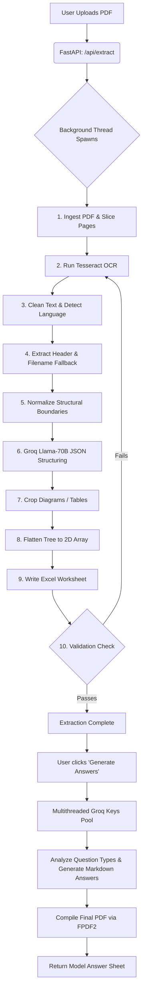

# Extracta v2.2 - Agentic AI Question Paper Processing Pipeline

## 🌟 Overview
Extracta is a state-of-the-art, AI-powered pipeline specifically engineered to ingest, analyze, and process highly complex, bilingual (English/Hindi), and hierarchical university exam papers (PDFs). It transforms raw unstructured PDFs into deeply structured Excel worksheets and compiles premium, fully-solved Model Answer Sheets as PDF documents.

Built on an agentic state-machine architecture using **FastAPI**, **LangGraph**, and **LangChain**, Extracta intelligently routes tasks, handles rate limits, manages fallbacks, and leverages cutting-edge Large Language Models (LLMs) via the **Groq API** to deliver unmatched precision in exam paper processing.

---

## ✨ Holistic Feature Set

### 1. 📄 Intelligent PDF Ingestion & OCR
*   **Dual-Page Booklet Slicing**: Automatically detects landscape booklets (A3/A4 stitched) and precisely slices them down the middle into sequential left-and-right pages, preventing cross-column reading corruption.
*   **High-Fidelity Rendering**: Uses PyMuPDF to convert PDFs into high-resolution imagery (300 DPI) for flawless character recognition.
*   **Bilingual OCR Processing**: Powered by Tesseract OCR configured for both English and Devanagari (Hindi) scripts (`eng+hin`), ensuring symbols, mathematical operators, and complex scripts are captured.

### 2. 🧠 Agentic AI Pipeline (LangGraph State Machine)
*   The entire workflow is orchestrated as a directed graph. Each step is a distinct "Node" that updates a shared `QPState` dictionary.
*   **Automatic Retries & Error Handling**: If validation fails (e.g., zero questions extracted), the graph automatically routes back to retry using alternative processing paths or next-available API keys.
*   **Telemetry Streaming**: Streams real-time progress updates and system logs to the interactive web frontend via Server-Sent Events (SSE).

### 3. 🎯 University-Aware Header Extraction
*   Extracts critical metadata: Subject, Paper Code, Max Marks, Time, Date, Semester, Branch, and Scheme.
*   **University Modes**: Contains specialized regex matching rules tailored for distinct formats like Mumbai University and ABVV (Atal Bihari Vajpayee Vishwavidyalaya).
*   **Filename Fallback**: Intelligently parses the original uploaded filename (`mcom-2-sem-managerial-concept-jun-2025.pdf`) as a fallback if OCR misses critical metadata.

### 4. 🌳 Deep Hierarchical JSON Structuring
*   Uses `Llama-3.3-70b-versatile` to comprehend the messy OCR text and rebuild the exact paper structure.
*   Recognizes parent-child relationships: Main Questions (Q1), Sub-questions (i, ii), and multiple-choice options (a, b, c, d / अ, ब, स, द).
*   Correctly identifies "OR" (अथवा) alternative questions.

### 5. 🌐 Seamless Bilingual & Hindi Support (Devanagari)
*   **Text Preservation**: Bypasses aggressive LLM cleaning for Hindi papers to ensure zero loss of native Devanagari characters.
*   **Strict Language Matching**: The Answer Generator enforces a critical language rule—if a question is asked in Hindi, the detailed model answer is generated entirely in fluent Hindi.

### 6. ✍️ Premium Model Answer Generator & Compiler
*   **Intelligent Categorization**: Classifies questions into types (MCQ, Differences, Define, Analysis, General Explanation, Instruction) to tailor the prompting strategy.
*   **Markdown to PDF Compiler**: Converts the LLM-generated markdown answers into beautifully formatted PDF documents using `fpdf2`, complete with complex text shaping for Hindi ligatures, specialized fonts (Nirmala UI), and academic styling.
*   **Instruction Overviews**: Detects section headers (e.g., "Answer any 5 of the following") and generates encouraging academic overviews instead of trying to literally answer the instruction.

### 7. 📸 Visual Extraction (Diagrams/Tables)
*   Scans the text for visual keywords. If found, uses OpenCV contour detection to locate and crop tables, charts, or diagrams from the original page images.

### 8. ⚡ Groq Key Pool Manager (Load Balancing)
*   Rotates through 6 concurrent Groq API keys to bypass rate limits (429 errors) and Daily Token Limits.
*   Multithreaded execution solves 5-10 questions in parallel, drastically reducing the time required to generate complete model answer sheets.

### 9. ✨ "Spark" Micro-Learning Generator
*   A specialized endpoint that takes a question and generates an intellectually captivating 3-part micro-lesson (Real-world Connection, Mind-blowing Fact, Curious Quest) to inspire students.

---

### 3. Agentic Multi-LLM Orchestrator (Answers Engine)
**Purpose:** Answers are the most computationally heavy part of the pipeline. To guarantee state-of-the-art academic accuracy, optimal API quota usage, and hallucination-free output, Extracta V2.2 deploys a **Multi-LLM Router Architecture** combined with a Wikipedia Retrieval-Augmented Generation (RAG) system.

**The Orchestrator Router:**
For every single question, the system first pings the **Master Orchestrator LLM** (`llama-3.1-8b-instant`). The Orchestrator analyzes the question's text, subject domain, language, and weightage (marks) to output a strict JSON configuration. 

**Dynamic Model Routing:**
Based on the Orchestrator's decision, the question is routed to a specialized LLM:
*   **Math & Code Specialist (`deepseek-r1-distill-llama-70b`)**: A heavy reasoning model deployed exclusively for solving deep mathematical equations, proofs, or programming algorithms.
*   **Hindi Specialist (`llama-3.3-70b-versatile`)**: Deployed exclusively when the Orchestrator detects native Hindi/Devanagari text, ensuring perfect linguistic grammar.
*   **Umbrella Filter (IGNORE)**: If the Orchestrator detects an instruction like *"Attempt all questions"*, it bypasses LLM generation entirely, saving thousands of tokens.
*   **General Fallback**: Standard questions are handled by the fast `llama-3.1-8b-instant` to preserve rate limits.

**Wikipedia RAG Integration:**
If the Orchestrator determines a question is highly theoretical or holds a massive weightage, it sets a `requires_research` flag. Extracta will seamlessly scrape the top Wikipedia summary for the core concepts and inject it as Ground Truth Context into the specialist LLM, effectively preventing hallucinations and maximizing the student's marks.

**Key Rotation (`GroqKeysPool`):**
Because we are hitting 3 different Groq models in parallel across 10-25 questions simultaneously, the `GroqKeysPool` continuously rotates through 6 distinct API keys (`EXT1` to `EXT6`) to bypass `429 Too Many Requests` API limits.

---

## 🏗️ System Architecture & Working Chart

### 🧠 Groq Model Load-Balancing Hierarchy
To process multiple papers in bulk (10-12 papers/day) without hitting strict API daily rate limits, Extracta implements a brilliant hybrid load-balancing architecture. It routes token-heavy text generation to high-limit models and reserves the smartest model *strictly* for complex JSON structuring.

1.  **LLM Cleaning pass**: `meta-llama/llama-3.1-8b-instant` (or similar high-limit model)
    *   *Why*: This step cleans raw OCR text for every page. It doesn't require complex reasoning, just basic formatting. Offloading this high-frequency, low-complexity task to an 8B model saves tens of thousands of tokens from the structural model's daily limit, acting as a highly efficient filter.
2.  **Answer Generation**: `meta-llama/llama-3.1-8b-instant` 
    *   *Why*: Generating detailed academic answers for an entire paper is extremely token-heavy (consuming 15,000+ tokens per paper). The 8B model is highly capable of answering standard academic questions accurately. By assigning this bulk text generation to a token-abundant model, the system can answer multiple papers in parallel without exhausting the premium model's quota.
3.  **JSON Structuring**: `llama-3.3-70b-versatile`
    *   *Why*: Parsing messy OCR text into a rigid, deep hierarchical JSON tree (detecting relationships between main questions, sub-questions, and MCQs) requires maximum spatial and logical reasoning intelligence. This model is reserved strictly for this step (~5,000 tokens/paper). Because its tokens are conserved entirely for this complex task, it fits perfectly within the strict API limits even across bulk runs.

#### ⚠️ The Inefficiency of a Single-Model Architecture
If the pipeline relied solely on a single premium model (e.g., just `llama-3.3-70b-versatile`) for every task—Cleaning, Structuring, and Answering—the system would be incredibly inefficient. A single paper would consume over 25,000 tokens. When multiplied by bulk processing, the system would instantly hit its 100,000 Tokens/Day rate limit after just 3 or 4 papers, entirely paralyzing the backend and causing 429 Error crashes. By adopting this multi-model routing strategy, Extracta maximizes throughput, dramatically lowers latency, and ensures high availability without sacrificing structural precision.

### Super Components & Sub-Components

#### A. Frontend Application (Vanilla JS / HTML / CSS)
*   **Drag & Drop Sanctuary**: The upload zone where users drop PDF files. Captures the original filename and triggers the upload sequence.
*   **Pipeline Wrapper & Explorer Panel**: Displays the live progression of the LangGraph nodes via glowing badges. The explorer reveals the parsed metadata, hierarchical tree, and allows users to trigger Answer Generation.
*   **Log Streamer**: Consumes the SSE stream from the backend to print live telemetry.

#### B. Backend Server (`main.py` - FastAPI)
*   **Task Database (`tasks_db`, `answers_db`)**: In-memory state management holding the progress and results of async background tasks.
*   **API Routes**: 
    *   `/api/extract`: Accepts the PDF, initializes a unique task ID, and spawns the pipeline thread.
    *   `/api/status/{task_id}`: The SSE endpoint streaming updates to the frontend.
    *   `/api/answers`: Triggers the multithreaded answer generation task.
    *   `/api/spark`: Generates the inspiring micro-lessons.

#### C. AI Agent Graph (`agent.py` - LangGraph & LangChain)
This is the core engine. It encapsulates the following sub-components (Nodes):

1.  **`pdf_ingestion_node`**: Uses `fitz` (PyMuPDF) to render images and slice dual-page layouts.
2.  **`ocr_node`**: Feeds the images into `pytesseract` to extract raw strings.
3.  **`cleaning_node`**: Applies regex cleanup and dynamic LLM noise-reduction (bypassed for pure Hindi to preserve characters).
4.  **`header_extraction_node`**: Invokes `_extract_header` (and its university-specific sub-functions) to pull metadata via Regex and original filename hints.
5.  **`normalization_node`**: Re-aligns boundary markers (like Q1, 1., i, a) so the LLM parser doesn't get confused by pagination breaks.
6.  **`structure_node`**: The heavy lifter. Prompts `Llama-3.3-70b` to convert the normalized string into a strict hierarchical JSON tree using a specialized schema.
7.  **`diagram_node`**: Fallback visual extractor using `cv2.findContours`.
8.  **`flatten_node`**: Recursively flattens the 3D JSON tree into a 2D array.
9.  **`excel_writer_node`**: Uses `openpyxl` to format the 2D array into a styled `.xlsx` file.
10. **`validation_node`**: The quality gate. Checks if the output is empty or malformed. If so, it routes back to `ocr_node` or `structure_node` for a retry.

#### D. The Answer Engine (Multithreaded LLM Solver)
*   **`generate_answers_for_tree()`**: Flattens the tree and dispatches questions to a `ThreadPoolExecutor` (max 6 workers).
*   **`GroqKeysPool`**: A thread-safe load balancer that monitors rate-limit headers. If a key hits its Token-Per-Day limit, it is cooled down for 23 hours, and traffic is seamlessly routed to the next key.
*   **`compile_answers_pdf()`**: An `FPDF` subclass (`ModelAnswersPDF`) that dynamically renders Markdown text, draws comparison tables, applies Nirmala UI fonts for Hindi support, and colors MCQ vs Descriptive headers elegantly.

---

## 🚀 Execution Flow (The Working Chart)

---

## 🛠️ Technology Stack
*   **Core Framework**: Python 3.10+, FastAPI
*   **AI / LLM Orchestration**: LangChain, LangGraph
*   **Models**: `llama-3.3-70b-versatile` (Groq)
*   **Computer Vision & OCR**: PyMuPDF (`fitz`), OpenCV (`cv2`), Tesseract OCR
*   **Document Generation**: `openpyxl` (Excel), `fpdf2` (PDFs)
*   **Frontend UI**: Vanilla Javascript, CSS3 (Glassmorphism design), HTML5
*   **Concurrency**: `threading`, `concurrent.futures.ThreadPoolExecutor`

---
*Extracta is built to process the messiest of university papers with unwavering resilience and agentic intelligence.*
